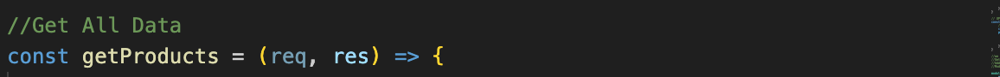
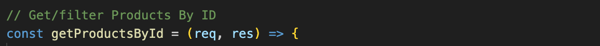
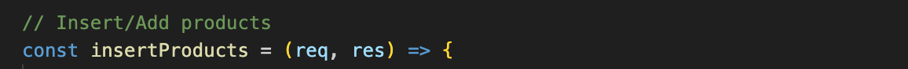

# Inventory API
  Inventory API is an endpoint that is used to retrive data from database.
  It consist four javascript files:
1. Controller.js
2. Route.js
3. Server.js
4. Queries.js

## Controller.js
## What is controller.js?
Controller module contains functions to handle HTTP requests for manageing products.

## What functions are created in controller module?
The functions that are in controller module are:

[orientation=portrait]
    • Description: Retrieves all products from the database.
    • Method: GET
    • Endpoint: /api/products
    • Request Parameters: None
    • Response: JSON array of products.

[orientation=portrait]
    • Description: Retrieves a product by its ID from the database.
    • Method: GET
    • Endpoint: /api/products/:id
    • Request Parameters:
               id: ID of the product to retrieve (integer)
    • Response: JSON object of the product.

[orientation=portrait]
    • Description: Inserts a new product into the database.
    • Method: POST
    • Endpoint: /api/products
    • Request Body:
            id: ID of the product (integer)
            name: Name of the product
            category: Category of the product
 
    • Response: "Added New Product successfully" (string)

image::images/update.png[alt=get,width-500px][orientation=portrait]
    • Description: Updates the category of a product in the database.
    • Method: PUT
    • Endpoint: /api/products
    • Request Body:
              id: ID of the product (integer)
              category: New category of the product
    • Response: "Updated Products Successfully" (string)

  

