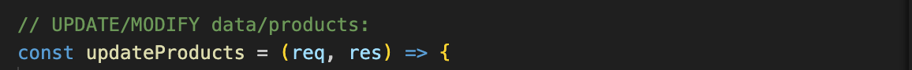

# Inventory API
  Inventory API is an endpoint that is used to retrive data from database.
  It consist four javascript files:
1. Controller.js
2. Route.js
3. Server.js
4. Queries.js

## Controller.js
## What is controller.js?
Controller module contains functions to handle HTTP requests for manageing products.

## What functions are created in controller module?
The functions that are in controller module are:

image::images/get.png[alt=get,width-500px][orientation=portrait]
    • Description: Retrieves all products from the database.
    • Method: GET
    • Endpoint: /api/products
    • Request Parameters: None
    • Response: JSON array of products.

image::images/filterproducts.png[alt=get,width-500px][orientation=portrait]

image::images/insert.png[alt=get,width-500px][orientation=portrait]

[orientation=portrait]

  

